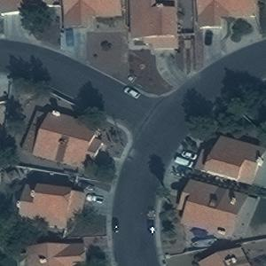
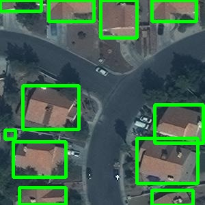

# satellite-building-counting

Подсчет домов со спутников снимков через instance segmentation




## Как работать с репозиторием

1. Скачать данные соревнования в папку ```data``` и разархивировать их
2. Скачать ```train.tar.gz``` из этого соревнования https://www.aicrowd.com/challenges/mapping-challenge
3. Запустить скрипт подготовки данных ```docker compose up --build data_creation```
4. Запустить обучение ```docker compose up --build train``` или загрузить модель в папку ```model``` по [ссылке](https://drive.google.com/drive/folders/1FgSbyJqueaXJKTOjSUY1vqGDoAaTTo4X?usp=sharing)
5. Для предсказания на тестовых данных запустить ```docker compose up --build inference```
6. Для визуализации детекции на тестовых данных можно запустить ```docker compose up --build draw_detections```